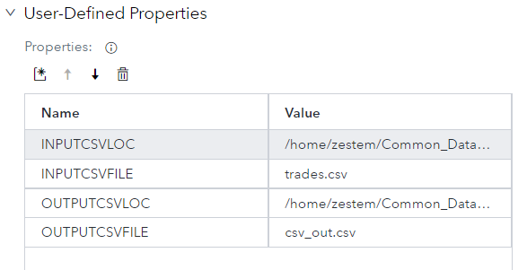
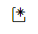
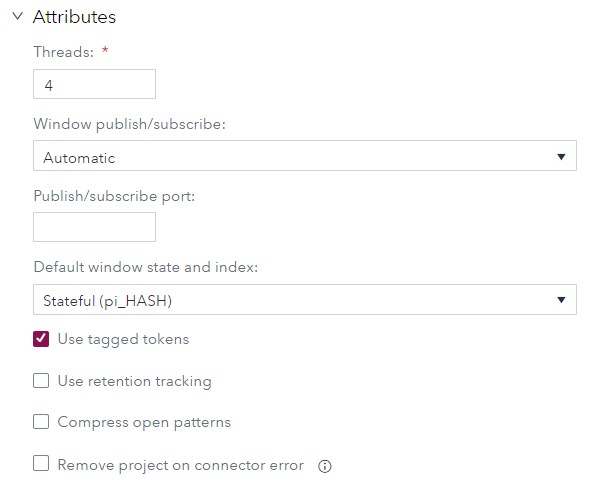

# Augmenting Streaming Events with Rolling Statistics

## Table of Contents

* [Introduction](#introduction)
	* [Learning Objectives](#learning-objectives)
* [ESP model](#esp-model)
	* [Source Window](#source-window)
	* [Calculating Rolling Statistics](#calculating-rolling-statistics)
		* [Copy Window](#copy-window)
		* [Aggregate Window](#aggregate-window)
	* [Join Window](#join-window)
		* [Tagged Token Event Flow](#tagged-token-event-flow)
			* [Example with Tagged Token Event Flow](#example-with-tagged-token-event-flow)
			* [Example without Tagged Token Event Flow](#example-without-tagged-token-event-flow)
		* [Stateless Join](#stateless-join)
		* [No-regenerates Option](#no-regenerates-option)
			* [Example with No-regenerates Turned Off](#example-with-no-regenerates-turned-off)
	* [Compute Window](#compute-window)
* [Steps to Build the Model](#steps-to-build-the-model)
	* [Open the Starter Project](#open-the-starter-project)
	* [Configure the User-Defined Properties](#configure-the-user-defined-properties)
	* [Add and Configure the Copy Window](#add-and-configure-the-copy-window)
	* [Add and Configure the Aggregate Window](#add-and-configure-the-aggregate-window)
	* [Add and Configure the Join Window](#add-and-configure-the-join-window)
	* [Configure Tagged Tokens](#configure-tagged-tokens)
	* [Add and Configure the Compute Window (optional)](#add-and-configure-the-compute-window-(optional))
	* [Add a Subscriber Connector (optional)](#add-a-subscriber-connector-(optional))
	* [Test the Model](#test-the-model)
* [Key Takeaways](#key-takeaways)
* [Prerequisites](#prerequisites)
* [Installation](#installation)
* [Examples](#examples)
* [License](#license)
* [Additional Resources](#additional-resources)

## Introduction

Let’s say you would like to know if the price of a stock is above or below the current average price, and by how much. Because the data is streaming, you would like to use SAS Event Stream Processor (ESP) to accomplish this but are not sure how it can be done.

The ESP model would need to process the incoming stock prices, calculate the average, and then join the original price with its average. It would then calculate the difference between the current price and the average price. The model would output an event with the current price, average price, and the difference between the two. The model also needs to be fast and should perform at maximum efficiency.

The following sections discuss how this can be done is ESP. This repository includes a completed model that you can run, and a starter model with just the Source window. The starter model allows you to construct the model yourself.

### Learning Objectives

Upon completion of this tutorial, you will be able to:

- Prevent an Aggregate window from becoming unbounded in growth by keeping the number of values it retains finite.
- Create a stateless join to not retain events and greatly improve performance.
- Prevent a Join window from re-generating values on the fact side when the dimension side of the join is updated.
- Synchronize two forks of a join and match tagged values with tagged calculated values using tagged token event flow.

## ESP model

_Figure 1 - ESP model_

The ESP model is not extremely complex. However, there are several details of the model that use some of the advanced features of ESP. If you follow these details, you can build a model that not only works, but is also efficient and lightweight.

### Source Window

The Source window is named `transaction_src` in the above diagram.

This model will work with any Source window using any type of connector if two requirements are met.

- The window accepts Insert events only
- The window is stateless (index pi_EMPTY)

The Source window takes input events and passes them through to the remainder of the model. The Source window cannot retain events because it utilizes the pi_EMPTY index and is stateless. It can only accept Insert events because accepting Deletes and Updates would require retaining events from the past. This would need a stateful index which can become inefficient. Using the pi_EMPTY index consumes very little memory. 

### Calculating Rolling Statistics

An Aggregate window is required to calculate the rolling statistics that will be joined with the original streaming event. This Aggregate window must be controlled so it does not become unbounded in growth. This is done by placing a Copy window before the Aggregate window that retains a finite number of events.

#### Copy Window

The Copy window is named `retain_15_mins` in the above diagram.

The Copy window retains the most recent 15 minutes of streaming events. This is accomplished through a by-time, sliding approach using the system clock. The window retains 15 minutes of data, and when a new event arrives the oldest event is dropped. This maintains a consistent amount of data for the Aggregate window to process. You can also use a field in the data to control the time.

The Copy window must be stateful to retain events. It uses the pi_HASH index. This index is in-memory and is faster than the pi_RBTREE index.

#### Aggregate Window

The Aggregate window is named `calc_acg_price_tot_quan` in the above diagram.

The Aggregate window is used to calculate the rolling statistics (e.g., average, sum) for the most recent 15 minutes of data. It receives its input from the Copy window. The Copy window is required to keep the aggregate window bounded in growth.

The events are grouped by symbol. Therefore, there is a single statistical value for each symbol. The Aggregate window must be stateful to retain the rolling aggregate values for each symbol. It also uses the pi_HASH index.

### Join Window

The Join window is named `augment_src` in the above diagram.

To augment events with rolling statistics, we must configure a special type of join in the Join window. The streaming event from the Source window is the left side (fact) of a join and the aggregation value is the right side (dimension) of a left-outer join.

Normally a Join window is stateful and requires a stateful index. It retains data for either the fact side or the dimension side so it can perform matches. An update to either side causes the other side to be updated. A typical join also causes all matching occurrences on the fact side of the join to be re-generated if the dimension side is updated.

In our scenario, we do not want the fact side of the join to be-regenerated when the dimension side is changed. In our case, the dimension (i.e., aggregate) side is continuously updated and only the current fact event is affected. To do this, the streaming event acting as the fact must wait for the aggregation to occur before the join is performed and an output event is created. We also want the join to be stateless as we have no need to store previous events. 

The following subsections discuss the configurations required to enable the Join window to act in the way we need. The following features are discussed:

- Tagged token event flow
- Stateless joins
- The No-regenerates option

#### Tagged Token Event Flow

Tagged token event flow enables each fork of an event to be tagged so that the side of the fork arriving first at the join waits for the tagged event of the other fork to arrive before performing the join and outputting an event. The Copy and Aggregate windows take longer to perform their operation than the event sent directly to the Join window. Therefore, the streaming event from the Source window waits for the corresponding event from the Aggregate window before outputting the augmented event.

To enable tagged token data flow, go to the Project Attributes and select Use tagged tokens.

##### Example with Tagged Token Event Flow

| ID | Symbol | Price | Avg Price | Quantity | Tot Quantity | Difference | 
| ------ | ------ | ------ | ------ | ------ | ------ | ------ | 
| 10116879 | LQD | 109.83 | 109.83 | 759 | 759 | 0 | 
| 10116880 | LQD | 109.94 | 109.885 | 100 | 859 | 0.055 | 
| 10116881 | LQD | 109.94 | 109.9033 | 100 | 959 | 0.036667 | 
| 10116882 | LQD | 109.94 | 109.9125 | 155 | 1114 | 0.0275 | 
| 10116883 | LQD | 109.94 | 109.918 | 101 | 1215 | 0.22 | 
| 10116884 | LQD | 109.94 | 109.9217 | 143 | 1358 | 0.183 | 

In the above example, we see that the `Price` and `Average Price` are the same in the first event. This makes sense for the first event of the group. The `Quantity` is also the same as the `Total Quantity`. The `Difference` between `Price` and `Average Price` is `0`.

When we look at the second event, we see that `Price` is no longer the same as `Average Price` as the average has been updated. The `Total Quantity` has also been updated by adding the `100` from the `Quantity` field. We now see a `Difference` of `0.055` between the `Price` and `Average Price`.

##### Example without Tagged Token Event Flow

| ID | Symbol | Price | Avg Price | Quantity | Tot Quantity | Difference | 
| ------ | ------ | ------ | ------ | ------ | ------ | ------ | 
| 10116879 | LQD | 109.83 |  | 759 |  |  | 
| 10116880 | LQD | 109.94 |  | 100 |  |  | 
| 10116881 | LQD | 109.94 |  | 100 |  |  | 
| 10116882 | LQD | 109.94 |  | 155 |  |  | 
| 10116883 | LQD | 109.94 | 109.83 | 101 | 759 | 0.11 |
| 10116884 | LQD | 109.94 | 109.885 | 143 | 859 | 0.055 |

The above example is with tagged token event flow turned off. Notice how there is no `Average Price` or `Total Quantity` until the fifth event. Additionally, the `Average Price` and the `Total Quantity` values are not aligned properly with the `Price` and `Quantity` values in the fifth event. The `Average Price` and `Total Quantity` are from the first event and the `Price` and `Quantity` are from the fifth event. We would like to see the current statistics, not the statistics from five events ago.

#### Stateless Join

Normally a Join window stores all events on the fact side of the join so it can go back and update any of them if a dimension changes. This makes the window stateful and can degrade performance over time.

Because the join does not need to create a local copy of the left driving window (fact window) for updates, the join can be stateless. It does not need to store events on the fact side because only the current event is augmented. The index used for the join is pi_EMPTY. A stateless join performs much more efficiently than an indexed join that performs updates.

#### No-regenerates Option

As stated previously, a typical left-outer or right-outer join re-generates corresponding fact events when the dimension side is changed. For example, there is a join with field `Salesman_ID` on the fact side and `Salesman_ID` and `Salesman_Name` on the dimension side. If the `Salesman_Name` is updated all events on the left side with a matching `Salesman_ID` are updated.

The type of join we want to perform should not re-generate fact events. In our case, the aggregate (right) side of the join is continuously updated, and we only want the current event to be augmented. Besides, re-generation is not possible because our join does not include an index to store fact events. The No-regenerates option optimizes memory usage by omitting the reference-counted copy of the fact window's index that is normally maintained in the Join window.

##### Example with No-regenerates Turned Off

| OpCode | ID | Symbol | Price | Avg Price | Quantity | Tot Quantity | Diff |
| ------ | ------ | ------ | ------ | ------ | ------ | ------ | ------ |
| I | 10116879 | LQD | 109.83 | 109.83 | 759 | 759 | 0 |
| P | 10116879 | LQD | 109.83 | 109.885 | 759 | 859 | -0.055 |
| I | 10116880 | LQD | 109.94 | 109.885 | 100 | 859 | 0.055 |
| P | 10116879 | LQD | 109.83 | 109.9033 | 759 | 959 | -0.07333 |
| P | 10116880 | LQD | 109.94 | 109.9033 | 100 | 959 | 0.036667 |
| I | 10116881 | LQD | 109.94 | 109.9033 | 100 | 959 | 0.036667 |

The first event (`ID 10116879`) has an OpCode of Insert (I) and is inserted as normal.  When the second event arrives, an Upsert (P) is issued to update the first ID (`ID 10116879`) because the average has changed. The second event (`ID 10116880`) is inserted. When the third event arrives, the first two events are updated. The behavior we desire is to update the current event only and never update that ID after that.

To disable the re-generation of fact events when a dimension is changed, select the **Set the “no-regenerates” option** in the **Join Criteria** of the Join window’s properties.

> NOTE: If the join type is left-outer or right-outer, the index is pi_EMPTY (stateless), and the No-regenerates option is turned on, this is as lightweight a join as possible.

### Compute Window

The Compute window is named `diff_price_avg_price` in the above diagram.

A Compute window is included in the model to calculate the difference between the `Price` and the `Average Price`. This window is not necessary. It is included in the example to make it more interesting. The Compute window also includes a subscriber connector to create an output csv file.

## Steps to Build the Model

A [complete model](files/Augment_Project.xml) is included in this repository. You can use it as a template and make changes. The repository also includes a [starter model](files/Augment_Start.xml) that includes a Source window configured to read the trades.scv file. You can add and configure the remaining required windows using the following high-level steps:

> NOTE: The following steps use this tutorial as the example. You can modify the value of the settings to meet your own needs.

### Open the Starter Project

1. Ensure ESP Studio is started.
1. Ensure the **Projects** page is displayed.
1. Double-click the **Augment_Start** project to open it.

### Configure the User-Defined Properties

_Figure 2 - User-Defined Properties_

Use the following steps to modify the project’s User-Defined Properties. This will provide the information required to read the `trades.csv` file and create the `csv_out.csv` output csv file.

1. Ensure the **Project Properties** pane is displayed. You can click  to display the **Project Properties** pane if not displayed.
1. Expand **User-Defined Properties**.
1. Edit the value of property **INPUTCSVLOC** to be the path to the `trades.csv` file (not including the filename or trailing /)
1. Ensure the value of property **INPUTCSVFILE** is **trades.csv**.
1. Edit the value of property **OUTPUTCSVLOC** to be the path to where the output csv file will be written (not including the filename or trailing /).
1. Ensure the value of property **OUTPUTCSVFILE** is **csv_out.csv**.

### Add and Configure the Copy Window

_Figure 3 - Copy Window State and Retention_

Use the following steps to add and configure the required Copy window.

1. In the **Windows** pane, expand **Transformations** and drag a Copy window into the model.
1. Create an edge to connect the Source window with the Copy window.
1. Select the Copy window and ensure the **Properties** pane is displayed. If the **Properties** pane is not displayed, click  on the right side of the page to display the **Properties** pane.
1. If necessary, expand **Name and Description** and type **`retain_15_mins`** in the **Name** field.
1. Expand **State** and ensure the **Window state and index** value is **Inherit from query (pi_HASH)**.
1. Expand **Retention** and ensure the retention properties are set as follows:
   1. Ensure the **Type** is **By-time, sliding**.
   1. Set the **Time limit** to **15 minutes**.
   1. Ensure **Use system clock** is selected for the **Time** field.

### Add and Configure the Aggregate Window

_Figure 4 - Aggregate Window Output Schema_

Use the following steps to add and configure the required Aggregate window so it calculates the average price and total quantity by symbol.

1.	In the **Windows** pane, expand **Transformations** and drag an Aggregate window into the model.
2.	Create an edge to connect the Copy window with the Aggregate window.
3.	Select the Aggregate window and ensure the **Properties** pane is displayed. If the **Properties** pane is not displayed, click  on the right side of the page to display the **Properties** pane.
4.	If necessary, expand **Name and Description** and type **`calc_avg_price_tot_quan`** in the **Name** field.
5.	Click  on the right side of the page to display the **Output Schema** pane.
6.	Click  to open the **Output Schema** window.
1. The key field specifies the field by which to group values. Add the key field as follows:
   1. Click  to create a new field.
   1. Select the checkbox under **Key**.
   1. Select **symbol** for the **Field Name**.
8. Add the average price aggregate field as follows.
   1. Click  to create a new field.
   1. Enter **`avg_price`** as the **Field** name.
   1. Select **double** as the **Type**.
   1. Select **ESP_aAve** as the **Aggregate Function**.
   1. Select **price** as the **Parameter**.
9. Add the total quantity aggregate field as follows:
   1. Click  to create a new field.
   1. Enter **`tot_quan`** as the **Field** name.
   1. Select **int32** as the **Type**.
   1. Select **ESP_aSum** as the **Aggregate Function**.
   1. Select **quantity** as the **Parameter**.

### Add and Configure the Join Window

Use the following steps to add and configure the required Join window. You will make the window is stateless, use tagged token event flow, and set the No-regenerates option.

1. In the **Windows** pane, expand **Transformations** and drag a Join window into the model.
1. Create the required edges in order:
    1. Create an edge to connect the Source window to the Join window. This side of the join will now act as the fact side.
    1. Create another edge to connect the Aggregate window to the Join window. This side of the join will act as the dimension side.

_Figure 5 - Join Window Output Schema_

3. Ensure the **Output Schema** pane is displayed and add fields as follows. If the **Output Schema** pane is not displayed, click  on the right side of the page.
    1. Click  to open the **Edit Output Schema – Non-Key Fields** window.
    1. Click  to open the **Copy Fields from Input Schema** window.
    1. Select the following fields and then click **OK**.
        - Symbol
        - Price
        - Quantity
        - Time
        - Avg_price
       - Tot_quan
1.	Enter a name for the window as follows:
    1. Ensure the Join window **Properties** pane is displayed. If the **Properties** pane is not displayed, click  on the right side of the page to display the **Properties** pane.
    1. If necessary, expand **Name and Description** and type **`augment_src`** in the **Name** field.
      
    

_Figure 6 - Join Window State_   

5.	Make the Join window stateless as follows.
    1. Expand **State**.
    1. Select **Stateless (pi_EMPTY)**.
   

_Figure 7 - Join Criteria_   

6.	Expand **Join Criteria** and select **Set the “no-regenerates” option** to not re-generate fact events when the dimension side of the join changes.

_Figure 8 - Join Conditions_ 

7.	Set the Join Conditions as follows:
    1. Expand **Join Conditions**.
    1. Click  to create a new join condition.
    1. Select **symbol** for the **Left: transaction_src** window.
    1. Select **symbol** for the **Right: Aggregate** window.

### Configure Tagged Tokens

_Figure 9 - Project Properties Attributes_

Use the following steps to enable the use of tagged tokens.

1.	Click  to display the **Project Properties** pane.
2.	Expand **Attributes**.
3.	Select **Use tagged tokens**.

### Add and Configure the Compute Window (optional)

_Figure 10 - Compute Window Output Schema_

Use the following steps to add and configure the optional Compute window to calculate the difference between Price and Average Price:

1.	In the **Windows** pane, expand **Transformations** and drag a Compute window into the model.
2.	Create an edge to connect the Join window with the Compute window.
3.	Select the Compute window and ensure the **Properties** pane is displayed. If the **Properties** pane is not displayed, click  on the right side of the page to display the **Properties** pane.
4.	If necessary, expand **Name and Description** and type **`diff_price_avg_price`** in the **Name** field.
5.	Click  on the right side of the page to display the **Output Schema** pane.
6.	Click  to open the **Output Schema** window.
7.	Click  to open the **Copy Fields from Input Schema** window.
8.	Select all fields and click **OK**.
9.	Add a calculated field for the difference between Price and Average Price as follows:
    1. Click  to create a new field.
    1. Enter **`diff`** as the **Field** name.
    1. Select **double** as the **Type**.
    1. Type **`price – avg_price`** for the **Expression**.
    1. Click **OK**.

### Add a Subscriber Connector (optional)

_Figure 11 - Connector Configuration Window_

Use the following steps to add an optional subscriber connector to the Compute window. This creates a csv file from the output of the Compute window. The directory to which the file is written is determined by the value of user-defined property OUTPUTCSVLOC. The filename is the specified value in user-defined property OUTPUTCSVFILE.

> NOTE: If you do not include the Compute window in your model you can add the subscriber connector to the Join window. The steps are the same.

1.	Ensure the Compute window is selected, and the **Properties** pane is displayed. If the **Properties** pane is not displayed, click  on the right side of the page.
2.	Expand **Subscriber Connectors**.
3.	Click  to create a new connector.
4.	Complete the required fields on the **Connector Configuration** window:
    1. Type any name for the connector in the **Name** field.
    1. Click **Snapshot**.
    1. Type **`@OUTPUTCSVLOC@/@OUTPUTCSVFILE@`** in the **Fsname** field.
    1. Type **`csv`** in the **Fstype** field.
5.	Click **OK**. A csv file will be created in the location you specified in user-defined property OUTPUTCSVLOC. The filename is the name you specified in the OUTPUTCSVFILE property.

### Test the Model

_Figure 12 - Test Page_

Use the following steps to test the model:

1. Click  to save the model. A model must be saved before it can be tested.
2. Click  to open the test page.
3. Click . The test should begin. The output csv file is created and continuously updated.
4. Select the various windows to see the model in action.
5. Download and review the output csv file created.

## Key Takeaways

In this tutorial we learned that ESP includes features that enable you to construct a fast, lightweight model that augments the current streaming event with the appropriate rolling statistic. There are several key takeaways from this tutorial:

- An Aggregate window can be bounded in growth by including a Copy window before it to limit the number of values the Aggregate window retains.
- A Join window can be stateless and use the pi_EMPTY index to prevent events being stored and greatly improve performance.
- Tagged token event flow causes the Join window to hold onto the current event and wait for the matching event from the aggregate side before outputting an event.
- The No-regenerates option prevents the fact side of the Join from being re-generated when the dimension side changes.

## Prerequisites

SAS ESP Studio

## Installation

You must upload some files to your environment to use the examples:

- [trades.csv](files/trades.csv)
- [Augment_Project.xml](files/Augment_Project.xml)
- [Augment_Start.xml](files/Augment_Start.xml)

## Examples

This repository includes three output csv files created by the model. One is normal out, and the other two illustrate what happense if one of the required options is not being used. The following output files exist:

| File | Description |
| ------ | ------ |
| [csv_out.csv](files/csv_out.csv) | Normal output using tagged tokens, stateless join, and the No-regeberat3es option turned on. |
| [csv_out_no_tagged_token.csv](files/csv_out_no_tagged_token.csv) | Output with Use tagged tokens turned off. |
| [csv_out_no_regen_off2.csv](files/csv_out_no_tagged_token.csv) | Output with the No-regenerates option turned off. |

## License

> This project is licensed under the SAS License Agreement for Corrective Code or Additional Functionality.

## Additional Resources

The following are additional resources available on this topic and other ESP topics:

* [SAS Event Stream Processing 2022.1.4 Documentation](https://go.documentation.sas.com/doc/en/espcdc/v_027/espwlcm/home.htm)
* [SAS Communities](communjities.sas.com)

